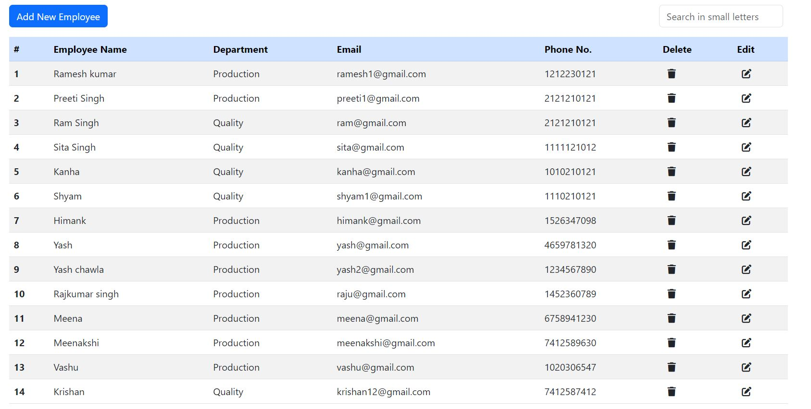

# crud_operations

# project-documentation

<p align="center">
  <a href="" rel="noopener">
 </a>
</p>


<h3 align="center">CRUD Operations</h3>

---

<p align="center"> Few lines describing your project.
    <br> 
</p>

## 📝 Table of Contents
- [About](#about)
- [Getting Started](#getting_started)
- [Deployment](#deployment)
- [Usage](#usage)
- [Flow Chart](#flowchart)
- [TODO](../TODO.md)
- [Contributing](../CONTRIBUTING.md)
- [Authors](#authors)
- [Acknowledgments](#acknowledgement)

## 🧐 About <a name = "about"></a>
In web development create, read, update, and delete (often referred to via the acronym CRUD) are the four basic operations of persistent storage. CRUD is also sometimes used to describe user interface conventions that facilitate viewing, searching, and changing information.In this project, MERN stack technology used. MERN means MongoDB, Express.js, React and NodeJs. MongoDB is a source-available cross-platform document-oriented database program. Classified as a NoSQL database program, MongoDB uses JSON-like documents with optional schemas. Express.js, or simply Express, is a back end web application framework for building RESTful APIs with Node.js, released as free and open-source software under the MIT License. React is a free and open-source front-end JavaScript library for building user interfaces based on components. Node.js is a cross-platform, open-source server environment. Node.js is a back-end JavaScript runtime environment, runs on the V8 JavaScript Engine, and executes JavaScript code outside a web browser.


## 🏁 Getting Started <a name = "getting_started"></a>
These instructions will get you a copy of the project up and running on your local machine for development and testing purposes. See deployment for notes on how to deploy the project on a live system.

### Prerequisites
What things you need to install the software and how to install them.

```
Give examples
```

### Installing
A step by step series of examples that tell you how to get a development env running.

Say what the step will be

```
Give the example
```

And repeat

```
until finished
```

End with an example of getting some data out of the system or using it for a little demo.

## 🔧 Running the tests <a name = "tests"></a>
Explain how to run the automated tests for this system.

### Break down into end to end tests
Explain what these tests test and why

```
Give an example
```

<<<<<<< HEAD


=======
>>>>>>> ccb3ef98e38119bc8d4d95dd9750ea018ced0479
## 🎈 Usage <a name="usage"></a>
Add notes about how to use the system.

## 🚀 Deployment <a name = "deployment"></a>
Require Some Time for Deployment

## ⛏️ Flow Chart <a name = "flowchart"></a>


- [MongoDB](https://www.mongodb.com/) - Database
- [Express](https://expressjs.com/) - Server Framework
- [VueJs](https://vuejs.org/) - Web Framework
- [NodeJs](https://nodejs.org/en/) - Server Environment

## ✍️ Authors <a name = "authors"></a>
- [Mahesh Dagar](https://github.com/mkdagakr) - FSD

## 🎉 Acknowledgements <a name = "acknowledgement"></a>
- Hat tip to anyone whose code was used
- Inspiration
- References
